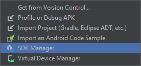
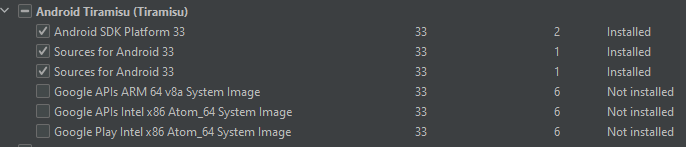
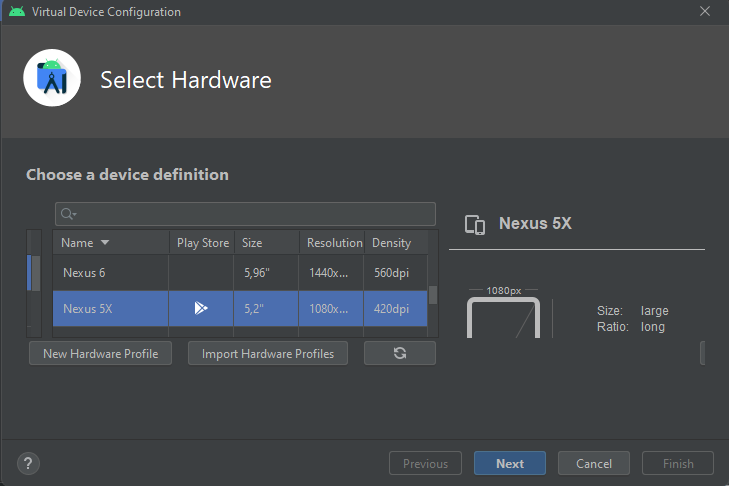
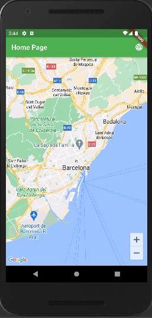

# GreenWheel MobileApp

Projecte per a l'assignatura PES de la Facultat d'Informàtica de Barcelona (FIB) de la Universitat Politècnica de
Catalunya (UPC).
<br/>**Quatrimestre:** Tardor curs 2022/2023.
<br/>**Temàtica:** MOBILITAT SOSTENIBLE: fomentar l'ús de vehicles elèctrics (punts de recàrrega,...) i bicing.

## Introducció

El nostre projecte consisteix en el desenvolupament d’una aplicació mòbil la qual està principalment enfocada per tota
aquella gent que disposi d’un cotxe elèctric i/o vulgui disposar de bicicletes durant uns dies.
<br>L’aplicació constarà d’un mapa en el qual es podran veure els punts de càrrega elèctrics de tot Catalunya i tots
aquells punts on hi hagi bicis disponibles per a ser llogades. La nostra principal innovació és que un usuari podrà
posar a disposició d’altres usuaris tant punts de càrrega com bicicletes, d’aquesta manera li proporcionen una utilitat
als seus carregadors i bicicletes quan els propis usuaris no en facin ús.

### Membres del grup

| Nom                  | GitHub username | Taiga username | Responsabilitat |
|----------------------|-----------------|----------------|-----------------|
| **Isslam Benali**    | Isslam1         | IsslamBenali   | Service         |
| **Arnau Giménez**    | arnau147        | arnau147       | Sprint 1        |
| **Cristina Migó**    | crismigo        | crismigo       | Sprint 2        |
| **Miguel Gutiérrez** | MikierXXV       | mikierxxv      | Demo tècnica    |
| **Daniel Oliveras**  | daniou          | daniou         | Inception       |
| **Andreu Orensanz**  | andyfratello    | andreuorensanz | Inception       |
| **Àlex Ollé**        | aolle99         | aolle99        | Sprint 3        |

### Professor responsable

Jordi Piguillem Poch ( [jpiguillem@essi.upc.edu](mailto:jpiguillem@essi.upc.edu) )

### Enllaços

- [Enllaç al entorn de PRE (NO DISPONIBLE)]()
- [Enllaç al entorn de PRODUCCIÓ (NO DISPONIBLE)]()
- [Enllaç al projecte Taiga](https://tree.taiga.io/project/arnau147-pes-green-whee/)
- [Repositori GitHub](https://github.com/orgs/Green-Wheel/repositories)

## Requeriments per a poder començar a treballar

### Introducció

A continuació trobareu un tutorial guiat per tal d'instalar-vos el projecte en local i poder començar a treballar-hi.
Aquest tutorial està pensat per a que sigui seguit en ordre, però si voleu podeu saltar-vos algun pas si ja teniu
instal·lat alguna de les eines que es demanen.
<br>Serà una guia d'instalació de com ho he fet jo, però si voleu podeu seguir
la [oficial](https://docs.flutter.dev/get-started/install).
<br>El tutorial està pensat per a windows. En qualsevol altre sistema operatiu, serà semblant, però no puc assegurar que
funcioni.
> PD: Si teniu mac, ho sento per vosaltres

### Instal·lació de Flutter

1. Descarregar el zip
   de [Flutter](https://storage.googleapis.com/flutter_infra_release/releases/stable/windows/flutter_windows_3.3.3-stable.zip)
   i descomprimir-lo a la carpeta que vulgueu (Recomano que tot el que instal·leu ho feu en un disc que tingueu molt
   espai). Cal que la carpeta no tingui permisos elevats (Program files) ni que el path tingui espais o caracters
   especials.
2. Afegir la ruta de la carpeta bin a les variables d'entorn.
    1. Buscar "editar variables d'entorn" i obrir el programa.
    2. A la pestanya "Avançat" seleccionar "Variables d'entorn".
    3. A la pestanya "Variables del sistema" seleccionar "Path" i editar-la.
    4. Afegir una nova variable amb la ruta de la carpeta bin de flutter(es troba en la carpeta resultant de
       descomprimir).
3. Comprovar que s'ha instal·lat correctament executant el següent comandament a la terminal:

```bash
flutter doctor
```

4. Si tot ha anat bé, hauríeu de veure això (pot ser que us surtin opcions malament, però més endavant les arreglarem):

```bash
Doctor summary (to see all details, run flutter doctor -v):
[√] Flutter (Channel stable, 3.3.3, on Microsoft Windows [versión 10.0.19043.1348], locale es-ES)
[√] Android toolchain - develop for Android devices (Android SDK version 31.0.0)
[√] Chrome - develop for the web
[√] Android Studio (version 2020.3)
[√] VS Code (version 1.62.3)
[√] Connected device (2 available)
```

### Instal·lar-se Android Studio

1. Descarregar Android Studio des de [aquí](https://developer.android.com/studio).
2. Instal·lar Android Studio (Recomano que ho intaleu en un disc que tingueu molt espai).
3. Obrir Android Studio i anar seguint les pantalles que van sortint.
   Quan us aparegui una que es diu SDK components setup, seleccionar l'ultima versió de la api que hi hagi (33 ara
   mateix), així com android virtual device si no està instalat. també android sdk. (vigileu el path)
4. Quan acabi, pulseu els tres puntets que hi ha a la dreta d'open i seleccionar "SDK Manager".
   
5. A la pestanya "SDK Tools" seleccionar "Android SDK Build-Tools,Android SDK Platform-Tools i Android SDK Tools" i
   seleccionar la última versió.
6. A la pestanya "SDK Platforms" seleccionar descarregar el següent.
   
7. Quan acabi, pulseu els tres puntets que hi ha a la dreta d'open i seleccionar "AVD Manager".
8. Crear un nou dispositiu virtual amb el següent:
   
9. Li doneu a next i seleccioneu android api level 33.
10. Finalitzeu i ja tindreu un mòbil virtual per a poder executar l'aplicació.

### Instal·lar-se Intellij IDEA

Podeu utilitzar tant Android Studio com intellij, però a mi m'agrada més intellij ja que està més actualitzat i permet
fer més coses que android studio. Si voleu utilitzar android studio, podeu saltar-vos els punts 1 i 2.

1. Descarregar Intellij IDEA des de [aquí](https://www.jetbrains.com/es-es/idea/download/#section=windows).
2. Instal·lar Intellij IDEA.
3. Instal·lar el plugin de flutter a intellij.
    1. Obrir intellij i anar a "File" -> "Settings" -> "Plugins".
    2. Buscar "flutter" i instal·lar el plugin.
    3. També recomano instal·lar el plugin de dart, flutter intl i flutter pub version checker.
    4. Reiniciar intellij.
4. Anar a "File" -> "Settings" -> "Languages & Frameworks" -> "Flutter".
5.
    1. Anar a "File" -> "Settings" -> "Languages & Frameworks" -> "Flutter" i seleccionar "Enable Dart support for the
       project".
5. Seleccionar la ruta de la carpeta bin de flutter (El zip que heu descomprimit abans).

### Acabar configuració de flutter

1. Obrir una terminal i executar el següent comandament:

```bash
flutter doctor --android-licenses
```

2. Acceptar totes les llicències.
3. Obrir una terminal i executar el següent comandament:

```bash
flutter doctor
```

4. Si tot ha anat bé, hauria de sortir-vos tot en correcte menys lo de visual studio (que no cal que tingueu instal·lat)
   .

### Obtenir el projecte

1. Obrir intellij o android studio i seleccionar Get from VCS.
2. Copiar el [link](https://github.com/Green-Wheel/MobileAPP) del projecte i enganxar-lo a la casella de text o anar a
   la pestanya GitHub i seleccionar el projecte GreenWheel/MobileApp.
3. Quan se us hagi clonat, haurieu de tindre tot el projecte.

### Afegir la api key de google maps

1. Anar a [Google Cloud Platform](https://console.cloud.google.com/) i crear un projecte.
2. Anar a "APIs & Services" -> "Credentials" i crear una nova clau de API.
3. Anar a "APIs & Services" -> "Library" i buscar "Maps SDK for Android" i activar-la.
4. Copiar la clau que heu creat i crear un fitxer anomenat .env al root del projecte.
5. Afegir la següent línia al fitxer .env:

```bash
GOOGLE_MAPS_API_KEY=LA_CLAU_QUE_HEU_CREAT
```

### Instalar dependencies

1. Anar al fitxer pubspec.yaml.
2. A dalt a la barra de menús, seleccionar "Pub get" i esperar que es descarreguin les dependencies.

### Executar l'aplicació

1. Seleccionar a dalt a la dreta el dispositiu virtual que heu creat.
2. Donar al play i esperar que s'instal·li l'aplicació.
3. Us hauria d'apareixer el movil virtual amb l'aplicació instal·lada.
4. Si no us surt, busqueu la pestanya a la barra lateral dreta anomenada Android Emulator.
5. Si tot ha anat bé, hauríeu de veure això:
   

### Ja està! Ara us recomano que aneu al fitxer apunts.md i llegiu els apunts que hi ha per a començar a fer el projecte.

## Enllaços d'interès

#### Documentació

- [Documentació de flutter](https://flutter.dev/docs)
- [Tutorial de com crear la primera aplicació](https://docs.flutter.dev/get-started/codelab)
- [Petits tutorials de funcionalitats](https://docs.flutter.dev/cookbook)
- [Codis d'exemple de funcionalitats](https://flutter.github.io/samples/#/)
- [Documentació de la api de google maps](https://pub.dev/packages/google_maps_flutter)
- [Llibreria de serveis de google maps](https://pub.dev/packages/google_maps_webservice)

#### Videos

- [Mini curs de YT de creació d'una copia de Uber amb flutter](https://www.youtube.com/playlist?list=PLy9JCsy2u97l8vY42NaXwsA_Y_LJXJyp6)
- [Curso YT des de 0 de flutter en Español 1](https://www.youtube.com/playlist?list=PLl_hIu4u7P677H9f6zPOHiOz2izkvQq2E)
- [Curso YT des de 0 de flutter en Español 2](https://www.youtube.com/playlist?list=PLgD-VLjdOvqj4qcsYTREjiLcVMK9vzbfj)
- [Video de 2h que explica una mica de tot](https://www.youtube.com/watch?v=CD1Y2DmL5JM&ab_channel=FlutterMapp)

Si trobeu algun enllaç més, no dubteu en posar-lo.